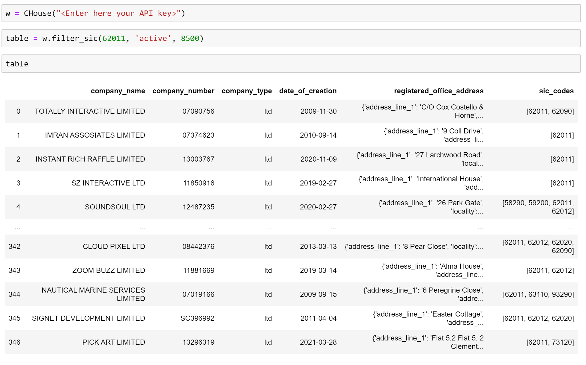
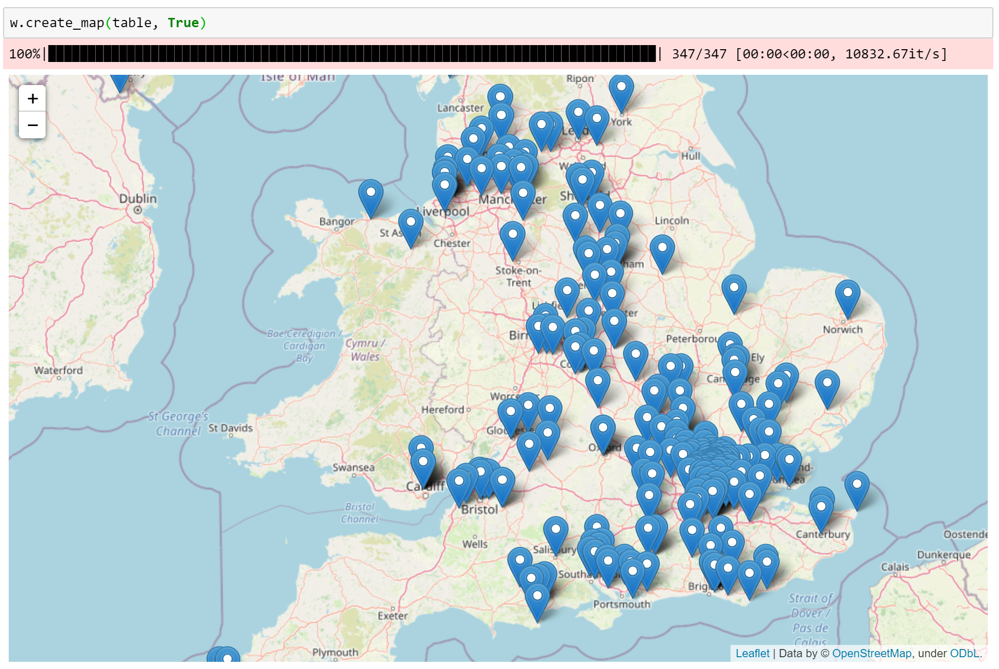
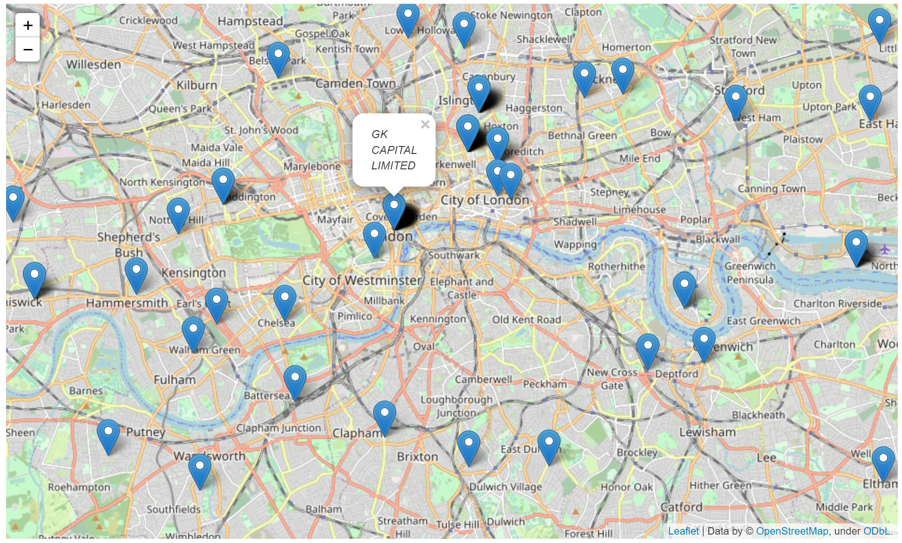
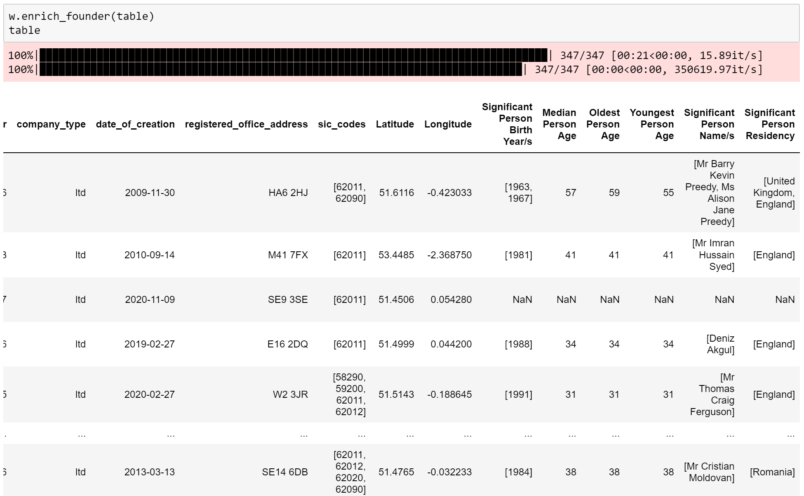
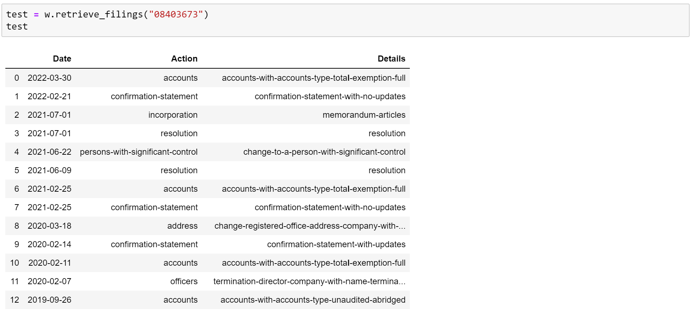

# CompaniesHouse API Wrapper

This code serves as a wrapper to interface with the Companies House API. 

## Crating a CHouse object

To interface with the compnaies house api, a CHouse object needs to be created. This is possible by passing a valid API key string into the CHouse class.

After a successful object creation, it is possible to filter companies after their SIC codes and current status (active, inactive). This filter and extraction process is done via the filter\_sic(sic\_code, status, start index) method. Please note that the start index determines where the extraction process should beginn. If all filter specefied companies shall be extracted, please set the start index to 0.

## Creating a company location Map

The filtered data can be enriched with the geographical location of the different companies. This can be achieved by calling the method create\_map(data, display map). The second argument of the method allows the user to specify if the map shall be instantly rendered within a jupyter notebook. Pleae note that the map will be saved within an CompanyMap.html file if the second argument is set to False.

## Enriching data with significant owner

The method enrich\_founder(data) will add information to the existing data by retrieving all owners with significant control based on the company id.

## Retrieve company filings

The method retrieve\_filings(company id) will retrieve the latest company filings based on the passed in company id.

